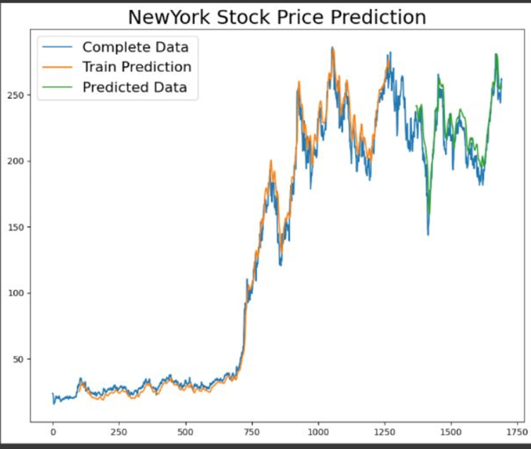
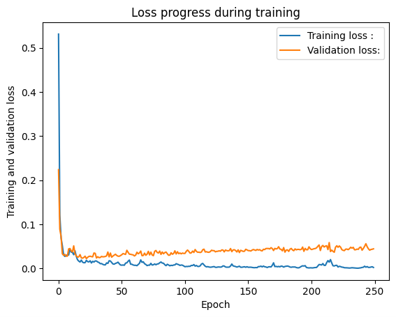

# New York Stock Prediction Model

## Overview:
The New York Stock Exchange dataset provides historical data on daily stock prices, including opening and closing prices, trading volumes, and market capitalizations. Our project aims to develop a predictive model that forecasts future stock prices based on historical data, assisting investors and financial analysts in predicting market trends.

The dataset comprises 851,264 rows and 7 columns. Our model achieves an impressive accuracy rate of 96%.

### Data Acquisition:
Acquiring and processing financial data, especially from large datasets like the New York Stock Exchange dataset, can be challenging. During the acquisition process, we encountered common issues such as data quality, format, structure, volume, and accessibility. We cleaned and processed the data to ensure reliability and suitability for analysis.

For detailed column descriptions, refer to the following:

- **Open:** Price from the first transaction of a trading day.
- **Close:** Price from the last transaction of a trading day.
- **Symbol:** Symbols denoting company names of stocks.
- **Volume:** Number of units traded in a day.
- **High:** Maximum price in a trading day.
- **Low:** Minimum price in a trading day.

[Download Dataset](https://drive.google.com/file/d/1IVYVh0ZfZxhBCDD8rYgDihKAu_B6HtO/view?usp=share_link)

### Data Cleansing and Transformation:
Data cleansing and transformation are critical steps in the data analysis process. We established data quality standards, developed a cleansing plan, and collaborated on transformation techniques to ensure consistency and accuracy in our analysis. We handled null values and outliers, ensuring robustness and reliability in our dataset.

### Exploratory Data Analysis (EDA):
EDA is crucial for understanding data patterns and identifying trends or anomalies. Our analysis included scatter plots and pair plots to visualize data distributions, relationships between variables, and potential biases or issues.

### Model Selection and Training:
We selected regression models for our problem and split the dataset into training and testing sets. We evaluated model performance using appropriate metrics and techniques, optimizing hyperparameters and ensuring robust training.

### Analysis of Loss Progression:
The provided image depicts the loss progression during model training. The blue line represents training loss, and the orange line represents validation loss. Initially, both losses decrease, but the validation loss starts to increase after a certain point, indicating potential overfitting.

### Conclusion:
Our New York Stock Prediction project demonstrates the power of machine learning in forecasting stock prices. The developed model serves as a valuable tool for decision-making and market analysis, highlighting the importance of data-driven approaches in finance.

For more details, refer to the codebase and feel free to connect.
